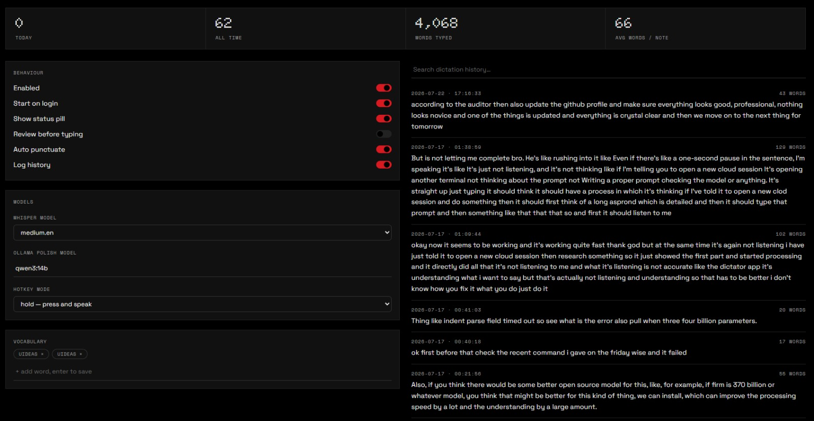
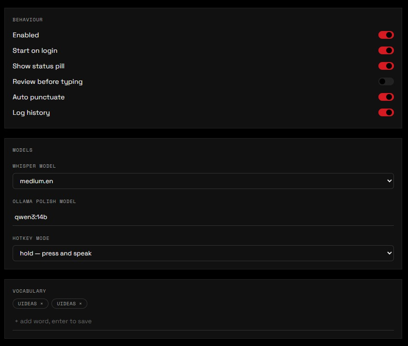
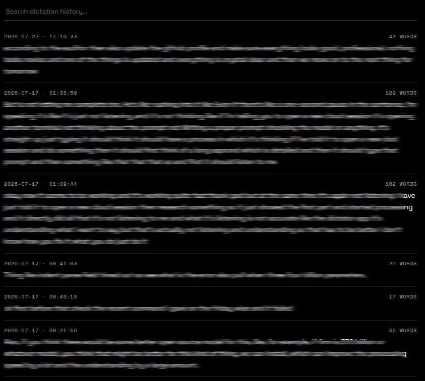

# Dictator


Local voice dictation for Windows. Hold **Ctrl + Win**, speak, release — your
words are transcribed on your own machine, cleaned up (filler words removed,
self-corrections resolved, grammar fixed), and typed into whatever app has
focus. No cloud, no accounts, nothing leaves your PC.

> **Status:** core dictation works reliably — this is my own daily driver.
> The dashboard UI is functional and improving. If this gets traction, more
> polish and bug fixes are next — [open an issue](../../issues) if something
> breaks or you want a feature.

<p align="center">
  
</p>

<p align="center"><sub><i>Dictation history is blurred in these screenshots for privacy — the app shows it in full.</i></sub></p>

<!-- TODO: record a 10-15s GIF of hold-to-dictate in action (ScreenToGif or
similar) and drop it in near the top — a moving demo would sell the
hold-speak-release loop better than a static dashboard shot can. -->

## Why this exists

I dictate most of my own notes, DMs, and scripts for Uideas — typing is
slower than talking, but every dictation tool I tried either shipped audio to
a cloud API or left "um"s and false starts in the transcript. Built this to
run fully local and clean up the mess a real voice makes, then kept using it
daily until it stopped breaking.

## How the cleanup works

Three local stages — nothing leaves your machine at any point:

1. **Capture** — hold the hotkey and speak; audio is buffered in memory.
2. **Transcribe** — [`faster-whisper`](https://github.com/SYSTRAN/faster-whisper)
   turns speech into text on-device, GPU-accelerated with a CPU fallback.
3. **Polish** — a local Ollama model strips fillers ("um", "you know"),
   resolves self-corrections ("12, no wait, 11" → "11"), and fixes grammar and
   punctuation. The result is typed into the focused app via simulated
   keystrokes. If Ollama is unreachable, you get the raw transcript instead of
   nothing.

## Install

Requires [Git](https://git-scm.com/downloads) and [Python 3.11+](https://python.org),
and optionally [Ollama](https://ollama.com/download) for transcript cleanup.
`install.ps1` installs Git for you via `winget` if it's missing.

```powershell
git clone https://github.com/IntellectDaksh/Dictator.git
cd Dictator
.\scripts\install.ps1
```

That one script creates the virtual environment, installs dependencies,
checks whether Ollama has a cleanup model pulled (suggests and downloads
`qwen2.5:7b-instruct` if not), and launches the app. Re-run it any time —
every step skips if it's already done.

After setup, just double-click `Dictator.bat` to start it again.

## Requirements

- Windows 10 or 11
- Python 3.11+
- ~1–3 GB free disk for the Whisper model you pick (base / small / medium)
- **Optional:** an NVIDIA GPU for faster transcription — CPU works, just slower
- **Optional:** Ollama plus a small instruct model for cleanup — skip it and
  you'll get raw, unpolished transcripts

Hit a snag during setup? See [docs/TROUBLESHOOTING.md](docs/TROUBLESHOOTING.md).

## How to use it

1. Click into any text box.
2. Hold **Ctrl + Win** and speak — the status bar turns red.
3. Release — it turns amber while cleaning up, flashes green when your text
   is typed.

Say it messy: "um let's meet at 12 no wait 11" becomes "Let's meet at 11."

## Features

- Hold-to-dictate or hands-free (double-tap for hold mode, single-tap toggle)
- Configurable hotkey — pick a preset or capture any combo live
- Local speech-to-text (`faster-whisper`), GPU-accelerated with CPU fallback
- Local cleanup LLM via Ollama — strips filler words, fixes grammar, resolves
  self-corrections, falls back to raw transcript if Ollama is unreachable
- App-aware tone (casual/formal/verbatim per focused app, user-editable)
- Snippets/macros — trigger phrase → canned expansion
- Voice commands: "new line", "new paragraph", "bullet point"
- Custom vocabulary for names/brand words
- Dictation history + stats dashboard (opt-in logging, off by default)
- Dark/light theme, custom accent color, start-on-login

## Dashboard

Everything is tunable from one screen, and logging is **off by default** —
nothing is stored until you turn it on.

| Behaviour, models & vocabulary | Searchable dictation history |
| :---: | :---: |
|  |  |

<sub><i>History text above is blurred for privacy.</i></sub>

## Tray menu (right-click the mic icon)

Enable/disable, pick microphone, pick Whisper model size (base/small/medium),
toggle status bar, toggle history logging, start on login, open config
folder, quit.

## Roadmap

Rough, honest, and subject to whatever breaks first:

- A short demo GIF of the hold → speak → release loop
- Dashboard polish pass
- More voice commands and snippet triggers
- Per-app tone profiles that ship with sensible defaults

PRs welcome — read [docs/ARCHITECTURE.md](docs/ARCHITECTURE.md) for the stack,
code map, and threading model before you send one.

## Privacy

Dictator runs entirely on your machine. Nothing about your voice or text is
ever sent anywhere.

- **Audio never hits disk.** It's held in memory only during transcription and
  discarded the moment it's done.
- **Everything is on-device.** Transcription runs locally via `faster-whisper`;
  the cleanup LLM runs locally via Ollama on `localhost`.
- **The only network traffic** the app ever makes is to Ollama at `localhost`,
  plus one-time model downloads when you first install. There is no server of
  mine in the loop — ever.
- **Your clipboard is never touched.** Text is inserted with simulated
  keystrokes, so nothing you've copied gets read or overwritten.
- **History logging is opt-in and off by default.** Turn it on and entries are
  stored only in your local config folder — you can clear them at any time.
- **No telemetry, no analytics, no crash reporting, no accounts, no API keys.**

The dictation history shown in the screenshots above is blurred — that's me
protecting my own notes, not a product feature.

## License — personal use only

Dictator is free for your **own personal use**. That's the whole grant.

- ✅ Use it and modify it for yourself.
- ❌ **No selling**, reselling, sublicensing, or bundling it into anything you
  charge for.
- ❌ **No publishing, reposting, or redistributing** it — in whole or in part,
  publicly or privately — without my written permission.

Want to use it for anything beyond that? Ask first: **uideasofficial@gmail.com**.
Full terms in [LICENSE](LICENSE).
