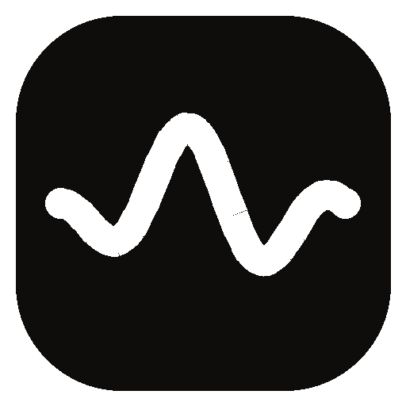

<div align="center">
  

  # Dictator

  **Talk. It types — cleaned up, not just transcribed.**

  
  
  
  
</div>

Local voice dictation. Hold a hotkey, speak, release — your words are
transcribed on your own machine, cleaned up by a local AI pass (filler words
removed, self-corrections resolved, grammar fixed), and typed into whatever
app has focus. No cloud, no accounts, nothing leaves your PC.

A free, local-first alternative to tools like Wispr Flow — with one thing
most free/open dictation tools skip entirely: **the AI cleanup pass**. Most
alternatives just hand you a raw transcript; Dictator fixes it before it
lands in your text box.

> **v1.** Core dictation is my own daily driver on Windows. macOS support
> just landed and hasn't been run on real Mac hardware yet — the dashboard
> UI is functional, the fundamentals work. If this gets traction, deeper
> mac testing and more features are next — [open an issue](../../issues) if
> something breaks or you want a feature.

## Where it fits

| | Cloud dictation apps (Wispr Flow, etc.) | Other open-source dictation tools | Dictator |
|---|---|---|---|
| Cost | Subscription | Free | Free |
| Audio leaves your PC | Yes | No | No |
| Cleans filler words / self-corrections | Yes | Usually not — raw transcript only | Yes, local |
| Works offline | No | Yes | Yes |
| App-aware tone (casual/formal/verbatim) | Rare | No | Yes |

The gap this fills: free and open dictation tools exist, but almost all of
them stop at the raw Whisper transcript. Dictator adds the cleanup pass —
the part that actually makes a transcript usable — without sending anything
to a server to do it.

## Install

**Windows** — PowerShell:

```powershell
irm https://raw.githubusercontent.com/IntellectDaksh/Dictator/main/scripts/bootstrap.ps1 | iex
```

**macOS** — Terminal:

```bash
curl -fsSL https://raw.githubusercontent.com/IntellectDaksh/Dictator/main/scripts/bootstrap.sh | bash
```

Either one-liner clones the repo, creates a virtual environment, installs
every dependency, checks whether you already have a local Ollama cleanup
model pulled — and if not, tells you what it recommends and asks a plain
yes/no before downloading anything — then launches the app. Safe to re-run
any time; every step skips if it's already done.

Requires [Git](https://git-scm.com/downloads) and Python 3.11+ (the
Windows script installs Git via `winget` if missing; the macOS script
installs Homebrew + Python if missing) and optionally
[Ollama](https://ollama.com/download) for the cleanup pass.

After setup: double-click `Dictator.bat` (Windows) or `Dictator.command`
(macOS) to start it again.

**macOS note:** the first time you dictate, macOS will prompt for
Accessibility + Input Monitoring permission (needed to detect the hotkey and
type text) — grant it in System Settings → Privacy & Security and try again.
macOS support is new and best-effort; see `info.md` for exactly what's
platform-specific if something misbehaves.

## Why this exists

I dictate most of my own notes, DMs, and scripts for Uideas — typing is
slower than talking, but every dictation tool I tried either shipped audio to
a cloud API or left "um"s and false starts in the transcript. Built this to
run fully local and clean up the mess a real voice makes, then kept using it
daily until it stopped breaking.

## How to use it

1. Click into any text box.
2. Hold **Ctrl + Win** (Ctrl + Cmd on macOS) and speak — the status bar
   turns red.
3. Release — it turns amber while cleaning up, flashes green when your text
   is typed.

Say it messy: "um let's meet at 12 no wait 11" becomes "Let's meet at 11."

## Features

- Hold-to-dictate or hands-free (double-tap for hold mode, single-tap toggle),
  with optional silence auto-stop
- Configurable hotkey — pick a preset, capture any combo live, or save named
  hotkey profiles
- Local speech-to-text (`faster-whisper`), GPU-accelerated on Windows with
  CPU fallback everywhere
- Local cleanup LLM via Ollama — strips filler words, fixes grammar, resolves
  self-corrections, falls back to raw transcript if Ollama is unreachable
- Language selection — 12 languages plus auto-detect
- App-aware tone (casual/formal/verbatim per focused app, user-editable) and
  spoken tone overrides ("...make it formal")
- Voice commands: "new line", "new paragraph", "bullet point"
- Snippets/macros, custom vocabulary for names/brand words
- Redaction list — sensitive words/phrases scrubbed before they're ever
  written to disk
- Dictation history + an Insights tab (streak calendar, app usage, WPM, tone
  distribution, hourly activity) — opt-in logging, off by default
- Dark/light theme with independently configurable accent and highlight
  colors, start-on-login

## Tray menu (right-click the mic icon)

Enable/disable, pick microphone, pick Whisper model size (base/small/medium),
toggle status bar, toggle history logging, start on login, open config
folder, quit.

## FAQ

**Does any audio or text leave my machine?**
No. Speech-to-text runs locally via `faster-whisper`, cleanup runs locally
via Ollama on `localhost`. The only network calls are to Ollama itself and,
during install, pulling the models. See [Privacy](#privacy) below.

**Do I need a GPU?**
No — CPU works fine, GPU (CUDA, Windows only) just makes transcription
faster. `faster-whisper` picks whichever is available.

**What if Ollama isn't running or the cleanup model isn't pulled?**
Dictator falls back to the raw (optionally auto-punctuated) transcript
rather than failing silently. You never lose a dictation because the
cleanup step had a bad moment.

**Can I use my own cleanup model instead of the default?**
Yes — any model pulled in Ollama works; set it from Settings.

**Windows or macOS — which is more solid right now?**
Windows. It's the daily driver this was built for. macOS support is real
(every platform-specific call is branched and implemented) but hasn't been
run on physical Mac hardware yet — see the note in [Install](#install).

## Troubleshooting

See [docs/TROUBLESHOOTING.md](docs/TROUBLESHOOTING.md) for common issues and
the config file reference.

## Architecture

See [docs/ARCHITECTURE.md](docs/ARCHITECTURE.md) for the stack, code map, and
threading model — read that before sending a PR. `info.md` has the deeper,
line-number-level map if you're picking this up cold.

## Privacy

Audio lives in memory only and is discarded after transcription. Clipboard is
never touched — text is typed via simulated keystrokes. The only network
traffic is to Ollama on `localhost`, plus one-time model downloads during
setup. No telemetry, no accounts, no API keys.

## License

MIT + Commons Clause — free to use, modify, and share; not for resale. See
[LICENSE](LICENSE).

---

[](https://star-history.com/#IntellectDaksh/Dictator&Date)
